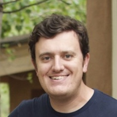
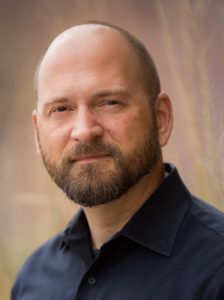
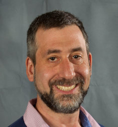

  

# Distributed, GPU-Aware, Task-Parallel Programming with FleCSI
## LA-UR-25-26445

## Abstract

FleCSI is a C++ library that simplifies the development of portable, scalable scientific computing applications.
It provides a distributed, a task-parallel programming model that abstracts away the complexity of parallelism, data management, and execution across architectures.
By managing interprocess communication and synchronization on behalf of the application, FleCSI protects developers from common pitfalls such as race conditions and deadlocks.
It also coordinates data movement between CPUs and GPUs, ensuring that GPU kernels receive data in a form that is optimized for data-parallel computation.

This tutorial will be the first public hands-on session for FleCSI.
Participants will learn the core programming models that make FleCSI unique: the Control Model for defining control-flow logic, the Data Model for managing distributed fields and topologies, and the Execution Model for running parallel tasks.
The session will emphasize building real-world HPC applications, including demonstrations of on-node parallelism, tasks, and specialization mechanisms.

The tutorial includes live coding exercises that guide attendees in developing a scalable FleCSI application from a serial example.
By the end of the session, participants will be equipped to create their own performance-portable HPC applications using FleCSI’s abstractions.

FleCSI is actively used in research applications such as FleCSPH and HARD, showcasing its applicability in astrophysics, multi-physics simulations, and radiation hydrodynamics.
Its open-source nature makes it an attractive choice for research teams building future-proof applications on emerging architectures.

---

## Target Audience

**Audience Level:** Beginner to Intermediate.
Working knowledge of C++ (classes, templates) is assumed. Prior experience with MPI or OpenMP is helpful but not required. Familiarity with computational science concepts may improve understanding of the examples.

**Audience Size:**
Expected: 30–50 participants.
Maximum: 60 (infrastructure-limited).

---

## Presenters Information

### Julien Loiseau

Julien Loiseau is a computer scientist at Los Alamos National Laboratory, where he contributes to scalable software solutions for scientific computing.
He is one of the developers of FleCSI and has led its adoption in multi-physics simulation projects.
Julien has taught tutorials and courses in HPC programming models at LANL and has mentored students in the Co-Design Summer School.
His research focuses on distributed runtime systems, portable programming models, and scientific code design.

### Davis Herring

Davis Herring is a physicist and computer scientist with experience in numerical modeling techniques and software library design.
Before working on FleCSI, he was the lead architect for Ingen, the unified library developed by the SimTools project for creating geometric models, 2D meshes, and physical parameter input for computational physics simulations.
He has also published on the subject of molecular dynamics simulations conducted in T-1.
Davis represents LANL on the ISO C++ committee; in turn, he has worked to improve the user-interface and maintainability of FleCSI 2 by taking advantage of modern C++ features.
Davis is the current technical lead for FleCSI.

### Ben Bergen

Ben Bergen is a senior scientist at LANL with a focus on applied mathematics, programming abstractions, and high-performance software design.
He leads the Task-Parallel Project (TPP) that oversees FleCSI, and has contributed to a wide range of simulation codes in fluid dynamics, astrophysics, and radiation transport.
Ben brings extensive experience in developing scalable numerical methods and has delivered HPC software training across the DOE complex.

### Scott Pakin

Scott Pakin has worked since 2002 as a LANL scientist.
He has researched over time a variety of computer-science topics related to high-performance computing, including programming models, application performance analysis, energy efficiency, high-speed communication, and most recently, quantum computing.
He led the Exascale Computing Project's Hardware Evaluation effort, performed by researchers at six national laboratories and multiple universities.
For over five years Scott has been co-teaching an introductory quantum-computing tutorial at both the SC and QCE conferences.

---

## Tutorial Structure

**Duration:** Half-day session (3 hours), two 90-minute blocks with a break.

### Outline

- **Introduction and Setup (30 minutes)**
  - Overview of FleCSI, terminology, Flog
  - Hands-on: Setting up the development environment and base application

- **Control Model and Runtime Model (30 minutes)**
  - Concepts: actions, control points, execution flow
  - Hands-on: defining control structure in a FleCSI app

- **Data Model (30 minutes)**
  - Concepts: fields, index spaces, layouts (dense, sparse, particle), allocation
  - Hands-on: registering fields and allocating data structures with a specialization

- **Break**

- **Execution Model (40 minutes)**
  - Concepts: task signatures, privileges, accessors, mutators, futures, further task semantic
  - Hands-on: writing and executing distributed tasks

- **On-Node Parallelism (40 minutes)**
  - Concepts: on-node parallelism with `forall`, `reduceall`, portable tasks
  - Hands-on: adding OpenMP-based node-parallelism to an existing tasks

- **Closing + Q&A (10 minutes)**
  - Guidance on next steps and further learning

---

## Training Material

Slides:

<embed
  src="assets/tutorial.pdf"
  type="application/pdf"
  width="100%"
  height="600px" />

Exercises:

https://github.com/flecsi/training
